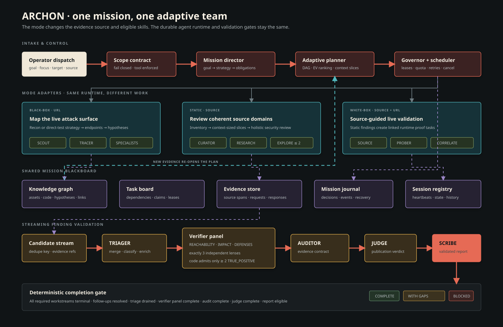
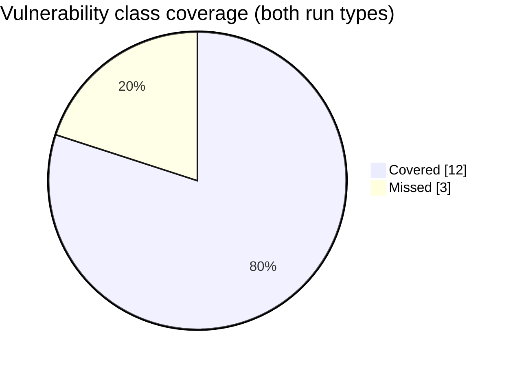

<div align="center">


**Autonomous AI web-application penetration tester — white-box + black-box in one engagement.**

ARCHON is an autonomous AI penetration tester for web applications. Instead of one prompt told to
"find every bug," it runs a durable mission team: a lead turns the engagement goal into a task graph,
persistent researchers review coherent parts of the target with specialist skills, bounded explore agents
follow evidence, and independent validators challenge every candidate before publication. Confirmed,
de-duplicated findings — each written up with CWE, CVSS, reproduction, impact, and remediation — reach the
**Findings board** as the mission progresses. Point it at a **URL** for black-box testing, **source code**
for static review, or **both** for source-guided white-box validation.

[](./LICENSE)
[](https://github.com/ghostshift-content/ARCHON/actions/workflows/ci.yml)
[](https://nodejs.org)
[-d97757.svg)](https://claude.ai/code)
[](https://github.com/ghostshift-content/ARCHON/releases)
[](https://www.cve.org/CVERecord?id=CVE-2026-4524)

</div>

<p align="center"></p>

> ⚠️ **Authorized testing only.** Only test systems you own or have explicit written permission to
> assess. ARCHON fails *closed* on missing scope and never fires impact-proving exploits by default,
> but **you** are responsible for staying within scope and the law.

---

## Install

```bash
git clone https://github.com/ghostshift-content/ARCHON.git archon && cd archon
bash setup.sh          # Node check → npm install → seed var/intel → preflight (npm run doctor)

npm start              # 1) the agent daemon (event-bus)
npm run dashboard      # 2) separate shell → portal at http://localhost:4000
```

Then open **http://localhost:4000 → New dispatch**.

**The one real prerequisite** is a **Claude subscription + the `claude` CLI, logged in** — ARCHON can run
every agent on your subscription over OAuth with no API key required (install
[Claude Code](https://claude.ai/code) and run `claude` once). Beyond that you need **Node ≥ 18** and
**git** (macOS / Linux, or Windows via WSL). A fresh clone needs **no config** — roots resolve to the repo
directory automatically. Optional black-box recon tools (`nmap`, `naabu`, …) are all fail-soft, so you can
skip them; a static code-review run needs only Node + `claude`.

`bash setup.sh` ends by running **`npm run doctor`** — a preflight that prints exactly what's present vs
missing (Node, the `claude` login, optional tools). Run **`npm run doctor`** any time a dispatch fails.

---

## Table of contents

- [Install](#install)
- [Why ARCHON](#why-archon)
- [How ARCHON works](#how-archon-works)
- [Features](#features)
- [The squads](#the-squads)
- [Engagement modes](#engagement-modes)
- [Benchmark](#benchmark)
- [Field-tested — a real CVE](#field-tested--a-real-cve)
- [Usage](#usage)
- [Configuration](#configuration)
- [Project structure](#project-structure)
- [Safety & scope](#-safety--scope)
- [Testing](#testing)
- [Development & contributing](#development--contributing)
- [Documentation](#documentation)
- [Roadmap & status](#roadmap--status)
- [License](#license--authors)

---

## Why ARCHON

A pentest is mostly orchestration: map the surface, fingerprint the stack, decide what to attack, try it,
**prove it's real**, write it up. ARCHON runs that as a durable multi-agent system instead of a single
prompt:

- **A team with shared context, not a monolith or job explosion.** A mission lead plans the work;
  persistent researchers apply relevant SQLi, XSS, SSRF, IDOR, API, business-logic and custom skills
  holistically inside coherent target slices. Evidence can create bounded follow-up work without an
  unbounded agent tree.
- **Evidence over claims.** Every finding is independently challenged; anything without the evidence
  required by its mode is demoted, not reported. The adaptive runtime adds three verifier lenses —
  reachability, impact and defenses — before audit and judge publication gates.
- **You stay in control.** Findings reach your board as the validation pipeline advances; when testing
  finishes the run completes and you generate the report on demand. Nothing is auto-published.
- **One report, both views.** White-box (source) and black-box (live) findings are correlated and
  de-duplicated — the same bug shows up as `file:line` *and* an HTTP repro.
- **Your subscription, no API key required.** The Agent SDK drives the bundled Claude CLI and can use your
  Claude subscription (OAuth). Set `ARCHON_SUBSCRIPTION_ONLY=1` to refuse configured API-key fallback.

---

## How ARCHON works

You dispatch a goal, authorized scope, and either a URL, source tree, or both. The durable daemon
(**NEXUS**, `event-bus.js`) gives that mission exactly one execution owner and drives it through a shared
agent lifecycle. The mode changes the work unit, eligible skills, evidence contract and confirmation rule;
it does not create three unrelated orchestrators.

<p align="center">
  <a href="./docs/ARCHON-AGENTIC-ARCHITECTURE.html">
    
  </a>
</p>

<p align="center"><sub>Full node contracts and traceable edges: <a href="./docs/ARCHON-AGENTIC-ARCHITECTURE.html">standalone interactive architecture explorer</a> (open locally).</sub></p>

1. **Scope and generation are pinned.** Universal scope prevalidation runs before target-directed work.
   The mission is immutably assigned to the compatibility, shadow, canary or active runtime, so an
   in-flight scan cannot change execution engine.
2. **The Mission Director creates obligations.** The lead interprets the goal, selected vulnerability
   focus and strategy, then the planner creates a dependency-aware task graph with reasons and definitions
   of done.
3. **The runtime assigns coherent work.** One persistent Researcher owns each application or source
   workstream and applies every relevant skill/persona lens in context. A Researcher may create at most two
   evidence-backed Explore tasks; Explore cannot recurse.
4. **New evidence can replan the mission.** Discoveries enter the shared task board, Knowledge Graph,
   evidence store and mission journal. Useful evidence can unlock a bounded follow-up; negative results
   stop repeated testing.
5. **Candidates enter a strict validation chain.** Structured candidates are de-duplicated and triaged.
   The adaptive runtime then assigns exactly three independent verifier lenses — `REACHABILITY`, `IMPACT`
   and `DEFENSES`. Deterministic code admits a candidate only after the complete panel and at least two
   `TRUE_POSITIVE` votes.
6. **AUDITOR and JUDGE control publication.** AUDITOR applies the mode-specific evidence contract; JUDGE
   issues the publication verdict. SCRIBE can consume only approved candidate IDs.
7. **A deterministic gate ends the mission.** Required workstreams, follow-ups, triage, verification,
   audit, judge and report eligibility must all reconcile. Unfinished or rate-limited work becomes an
   explicit coverage gap, never `no_issue`.

The three modes plug into that lifecycle differently:

- **Black-box:** application mapping is always required. `full_recon` adds infrastructure recon,
  `smart_auto` performs evidence-driven targeted recon, and `direct` skips Nmap/standalone fingerprint
  probes while retaining website/API mapping. Focused scans activate only selected vulnerability skills;
  custom abuse-driven objectives never expand scope.
- **Static:** source is packed into dependency-coherent, context-budgeted workstreams. Each Researcher
  reviews its slice holistically with all applicable patterns plus authorization, business-logic,
  missing-control and freehand reasoning. Source-only evidence can never become `RUNTIME_CONFIRMED`.
- **White-box:** runs the static source path first, then creates linked runtime-validation tasks for source
  candidates when an authorized URL exists. Without live proof, the result remains
  `SOURCE_CONFIRMED`/`NEEDS_LIVE_VALIDATION` and the report is preliminary.

The compatibility runtime remains the default execution owner while the adaptive runtime is promoted
through `shadow → canary → active` parity gates. Both use the same OAuth-backed Claude execution layer and
preserve the existing board/report contracts. See [Adaptive runtime](./src/runtime/README.md),
[system map](./docs/ARCHON-SYSTEM-MAP.md), and [orchestration](./docs/ORCHESTRATION.md).

---

## Features

| | |
|---|---|
| 🎯 **Black-box** | Full recon, smart-auto, or direct application testing. Website/API mapping remains mandatory; focused classes and custom abuse-driven objectives activate only relevant skills. |
| 🔬 **Static source review** | Context-budgeted, dependency-coherent source workstreams reviewed holistically with pattern catalogs, authorization/business-logic reasoning and bounded evidence-driven follow-ups. |
| 🔎 **White-box validation** | Static candidates create linked live-validation tasks against an authorized URL; source and runtime evidence remain distinct and correlate into one finding identity. |
| 🔗 **Merged engagement** | Run both; findings aggregate and one report **de-duplicates** the same vuln seen from source and over the wire. |
| 🧪 **Independent verification** | Three verifier lenses challenge reachability, impact and defenses before AUDITOR and JUDGE apply the evidence/publication gates. |
| 🏷️ **Honest confirmation status** | Each finding is tagged `RUNTIME_CONFIRMED` (proven live) vs `SOURCE_CONFIRMED` (proven in code only) vs `NEEDS_LIVE_VALIDATION` / `DISPROVEN` — a source read is never dressed up as a live proof. |
| 🧑‍⚖️ **Durable triage + judge gate** | Persistent triage batches de-duplicate and enrich candidates; exact-identity judge verdicts control report inclusion. |
| 🎛️ **Focused scans** | Pick specific classes ("XSS + access-control only") and the lead activates only those skill lenses — or run the full A→Z. |
| 🧠 **Agentic replanning** | Evidence can create bounded Explore work; leases, retries, cancellation, quota backpressure and explicit coverage gaps make long missions resumable and honest. |
| ⏸️ **On-demand reporting** | Review — confirm / reject / set CVSS (built-in 3.1 calculator) / annotate — then generate the report when ready. Nothing auto-publishes. |
| 🔁 **Iterations** | Add focused passes to an engagement ("now test access control") without disturbing prior results. |
| 🛡️ **Safety perimeter** | Fail-closed scope gate; impact-proving exploits fire only behind a 3-gate opt-in (off by default). |
| 🖥️ **Local portal** | Zero-build single-page dashboard (binds `127.0.0.1`) for dispatch, live progress, triage, and reports. |
| 📚 **Scored A–Z coverage** | Per-area coverage **scores** ("Authentication: 90%") across OWASP WSTG, reporting transport/config hygiene (TLS, HSTS, headers, cookie flags) alongside exploitable bugs — untested areas stated honestly. |

---

## The squads

Agents are **AI personas and skill bundles** executed through the Claude Agent SDK on your subscription.
In the adaptive runtime, the call-sign specialists are attached to coherent Researcher workstreams as
relevant lenses instead of creating a feature × vulnerability-class session matrix. The compatibility
runtime can still spawn the same call-signs independently. **NEXUS** is the daemon (`event-bus.js`), not a
persona.

### Compatibility squad: `pentest` (lead: **ATLAS**)

| Agent | Domain | | Agent | Domain |
|---|---|---|---|---|
| **ATLAS** | Lead / attack planner | | **GATEWAY** | API security (incl. JWT) |
| SCOUT | Recon / surface mapping | | SENTRY | Config & transport hygiene / compliance |
| RANGER | DAST + OS command injection | | KEYRING | Session management / auth |
| TRACER | Crawling / endpoint discovery | | LEDGER | Business logic |
| VIPER | XSS | | FORGE | Supply-chain / deserialization |
| DRILL | SQL injection | | DECOY | CSRF |
| RELAY | SSRF | | SPECTRE | XXE |
| VAULT | LFI / path traversal | | WARDEN | IDOR / access control / logic |

### Compatibility squad: `code-review` (lead: **CURATOR**)

`MARSHAL` (access control) · `CIPHER` (injection/XSS) · `QUILL` · `BEACON` · `BREAKER` · `SIPHON`
— feature mappers and per-class specialists · `PROBER` — runtime validator (live-checks source findings
against a deploy URL).

### Adaptive mission roles (`agents/archon-*.md`)

**ARCHON_LEAD** (mission goal and plan) · **INVENTORY** (authoritative surface) · **RESEARCHER**
(persistent holistic workstream owner) · **EXPLORE** (bounded evidence follow-up) · **VERIFIER**
(reachability / impact / defenses).

### Universal validation agents (`_universal/agents/`)

**AUDITOR** (independent verifier) · **ARBITER** (confidence judge / publication gate) · **SCRIBE**
(final reporter) · **COMMAND** (coordination) · **TRIAGER** (validate + dedup + merge, owns the Findings
board) · **WRITER** (per-finding writeup).

---

## Engagement modes

The three modes differ in their inputs, work units and evidence contracts. They retain the same mission
shape: lead → research/skills → triage → independent verification → audit → judge → report.

| Mode | Input | What runs |
|---|---|---|
| **Black-box** | URL | Live pentest — specialists fire payloads against the running target. |
| **Static** | source dir | Reads the code with read-only repository tools. Patterns and freehand reasoning produce source-evidenced findings; no live payloads are fired. |
| **White-box (combined)** | URL + source dir | Source review runs first; its candidates create source-guided live-validation work. The compatibility runtime uses PROBER/cross-view correlation; the adaptive runtime creates linked `runtime_validate` tasks. Both preserve separate source/runtime proof and merge one finding identity. |

An **engagement** holds N independent iterations (the white-box + black-box pair, plus any focused re-runs
you add). Findings aggregate across iterations and one report is generated over all of them. Every finding
states its confirmation status honestly: `RUNTIME_CONFIRMED` when proven live, `SOURCE_CONFIRMED` when
proven in code only — a source read is never presented as a live exploit.

---

## Benchmark

OWASP Juice Shop, scored on the vulnerability classes it is known to contain — the same ground truth and
scorer grade **both** run types against the same app. Full reports with charts and the per-class breakdown:
[`benchmark/RESULTS-blackbox.md`](./benchmark/RESULTS-blackbox.md) ·
[`benchmark/RESULTS-codereview.md`](./benchmark/RESULTS-codereview.md).

| Run type | Class coverage | Confirmed findings |
|---|---|---|
| **Black box** (live pentest) | **12 of 15 (80%)** | 26 |
| **Static / white-box** (code review) | **12 of 15 (80%)** | 48 (36 beyond the 15 classes) |



Same class coverage from both angles — but the source review goes **deeper**: reading all the code surfaces
roughly twice the confirmed findings (YAML-deserialization RCE, JWT algorithm confusion, unsalted-MD5
password storage, and more), each pinned to a file and line. Between them the black box covers SSRF that the
per-feature source pass mapped elsewhere, and the source review reaches code the live scan never hit.
Reproduce both with the harness in [`benchmark/`](./benchmark).

---

## Field-tested — a real CVE

Beyond the Juice Shop benchmark, ARCHON's **white-box review** found a real broken-access-control flaw in
a large production codebase — confidential issue data exposed through a missing authorization check. Jay
([@ghostshift-content](https://github.com/ghostshift-content)) reported it to **GitLab** via **HackerOne**;
it was fixed in GitLab's May 2026 security release and assigned
**[CVE-2026-4524](https://www.cve.org/CVERecord?id=CVE-2026-4524)** (CVSS 6.5, CWE-288).

- **CVE:** [CVE-2026-4524](https://www.cve.org/CVERecord?id=CVE-2026-4524)
- **GitLab advisory:** [patch release 18.11.3 · 2026-05-13](https://about.gitlab.com/releases/2026/05/13/patch-release-gitlab-18-11-3-released/)
- **More in the pipeline:** Additional vulnerabilities surfaced by ARCHON have been responsibly disclosed and are awaiting vendor remediation — held under coordinated-disclosure embargo, so they're not named here until they're fixed.

That's exactly the class ARCHON's code-review squad specializes in — the same access-control depth ships as
MARSHAL's 40-pattern access-control catalog.

---

## Usage

1. **Authorize.** Confirm you have written permission for the target. Copy
   `common/config/scope_template.yaml` as your engagement scope and load it in the dispatch form's
   **Scope** field — scope is fail-closed, so a dispatch with no scope config is blocked.
2. **Dispatch.** Portal → *New dispatch*: target URL, optional source directory, credentials, test type,
   focus classes (optional), and severity profile.
3. **Watch.** *Tasks* shows live phase progress, which agents are working, and the test plan; validated
   findings land on the run's *Findings* board as they're confirmed.
4. **Review.** When the run **completes**, open its *Findings* tab — the validated set is already there;
   confirm/reject each, adjust CVSS and severity, add notes.
5. **Report.** Click *Generate report*; SCRIBE writes one report (combined runs are correlated and
   de-duplicated) and it lands under `var/intel/reports/`.

The full operator workflow — authorization checklist, field-by-field dispatch guide, and troubleshooting —
is in **[OPERATOR-RUNBOOK.md](./OPERATOR-RUNBOOK.md)**.

---

## Configuration

**Most users can skip this section** — a fresh clone runs with no env vars set; override only for a
non-default layout or a server deploy.

`paths.js` is the single root resolver. It auto-loads `.env.local` (gitignored) at require time so the
daemon, dashboard, and every spawned subprocess pick the roots up — but all three roots are **optional**:
they resolve to the repo dir (and `var/intel` under it) when unset, falling back to the `/root/agents`
server layout only when it actually exists. So a clone, a container, and a server all work unconfigured.

| Var | Meaning |
|---|---|
| `KURU_AGENTS_ROOT` / `ARCHON_ROOT` | Code root (where `event-bus.js`, `paths.js`, `squads/` live). Default: the repo dir. |
| `KURU_INTEL_ROOT`  | Data-layer root (runtime state). Default: `var/intel` under the code root. `npm run setup` seeds it. |
| `KURU_CLAUDE_BIN`  | Path to the `claude` CLI the agents spawn (default: resolve `claude` on `PATH`, e.g. `which claude`). |

**An API key is not required.** The Agent SDK drives the bundled `claude` CLI, which uses the authenticated
OAuth session under `~/.claude` when no key is configured. Set `ARCHON_SUBSCRIPTION_ONLY=1` to remove any
configured key from agent subprocesses and guarantee subscription-only execution.

Optional, **off by default**:

| Var | Effect |
|---|---|
| `PORT` | Dashboard port (default `4000`). |
| `KURU_PORTAL_SQUADS` | Comma-separated squads the portal exposes (default `pentest`). |
| `ARCHON_PORTAL_TOKEN` | Require `Authorization: Bearer <token>` on `/api/*`. Set this before exposing the portal beyond localhost. |
| `ARCHON_SUBSCRIPTION_ONLY=1` | Hard-lock auth to your Claude **subscription** (OAuth). ARCHON never injects an API key for any agent — even if `ANTHROPIC_API_KEY` is in the env or a saved config — so runs can never fall through to metered API billing. |
| `ARCHON_RUNTIME_V2=shadow` | Build the adaptive plan, task board and UI projection without owning execution. Compatibility runtime remains authoritative. |
| `ARCHON_RUNTIME_V2=canary` + `ARCHON_RUNTIME_CANARY_PERCENT=<0-100>` | Pin a deterministic percentage of new missions to the adaptive runtime. Requires parity approval to execute. |
| `ARCHON_RUNTIME_V2=active` + `ARCHON_RUNTIME_PARITY_APPROVED=1` | Make the adaptive runtime authoritative for newly pinned missions. Existing missions retain their original owner. |
| `ARCHON_SCOPE_OVERRIDE=1` | Allow a dispatch with **no** scope config (Phase 0.0 is fail-*closed* — missing scope blocks the run). |
| `ARCHON_ACTIVE_POC=enabled` | Allow the gated Exploit-Prover to fire a **benign** impact-proving payload (e.g. RCE → `echo <nonce>`). Also requires `engagement_mode: active-poc` **and** a permission token in the dispatch. **Fires nothing by default.** Authorized engagements only. |
| `ARCHON_AUTONOMY=enabled` + `ARCHON_AUTONOMY_HOPS=<n>` | Surface the re-planning loop's follow-ups as an autonomy signal (hop-capped). The re-plan intel is always produced; this only flags auto-chase. |
| `ARCHON_ENABLE_AUTONOMOUS_OS=1` (+ `ARCHON_ENABLE_<block>` / `ARCHON_DRIVE_<block>`) | Controls older per-module experimental projections. This flag family is separate from the canonical adaptive-runtime generation above; it does not select mission execution ownership. |
| `ADAPTER=cli` | Use the CLI runner adapter (rollback floor) instead of the default SDK adapter. |

`var/` (all runtime state, findings, reports) is gitignored. See **[SETUP-LOCAL.md](./SETUP-LOCAL.md)** for
the portable-roots model in detail.

---

## Project structure

```
ARCHON/
├── event-bus.js              # the daemon (NEXUS): dispatch queue → phased pipeline → report
├── paths.js                  # portable-root resolver (KURU_* + .env.local autoload)
├── ownership.json            # persona → squad-home map
├── layout.config.json        # layout knobs (persona/state modes)
├── squads/                   # persona content (SOUL.md + skills) per squad
│   ├── pentest/agents/<name>/
│   └── code-review/agents/<name>/
├── _universal/agents/        # AUDITOR · ARBITER · SCRIBE · COMMAND · TRIAGER · WRITER
├── agents/                   # runtime agent logic
│   ├── runner/               # runAgent() chokepoint + sdk/cli adapters + bridge
│   ├── squads/<sq>/squad.json# operational config (enabledPhases, caps)
│   ├── squad-policy/         # per-squad scope/severity policy
│   └── *.js                  # finding schema, judge, handoff, browser verify, scope gates …
├── src/
│   ├── dispatch/             # code-review-dispatcher (white-box engine, surface-driven class selection)
│   ├── pipeline/             # env-fingerprint, attack-planner, chain-verifier, focus-map, streaming-triage …
│   ├── runtime/              # adaptive mission owner: planner, task board, leases, sessions, evidence, completion
│   ├── agents/               # canonical agent registry used as adaptive persona/skill bundles
│   ├── patterns/             # runtime pattern registry and catalog resolution
│   ├── routing/              # model router + target classifier
│   ├── core/                 # squad framework + WSTG coverage map (graded per-area scoring)
│   ├── intel/                # knowledge-graph + pattern-catalog engine
│   ├── orchestrator/         # Mission Director + task/queue/scope/safety governors (flag-gated autonomy)
│   ├── source-review/ · evidence/ · reporting/ · shadow/   # Autonomous-OS canonical paths (see ROADMAP)
│   ├── safety/               # scope/goal scrubbers, quarantine, production-safety guard
│   ├── learning/             # feedback loop, memory ranker
│   ├── grading/ · ops/ · integrations/ · rendering/ · utils/
├── common/                   # static KB: taxonomy (CWE/OWASP/WSTG), payloads, remediation, reporting
│   ├── patterns/             # 23 vuln-class pattern catalogs + index.json (PATTERN_AUTHORING_GUIDE.md)
│   └── schemas/              # dependency-free validators (no ajv / js-yaml)
├── schemas/ · prompts/       # finding/task JSON schemas + flat agent prompts (Autonomous OS)
├── workflows/ · skills/      # mode workflows and portable ARCHON skill entrypoints
├── setup.sh                  # one-shot local installer (npm install → seed → Claude login check)
├── scripts/                  # dashboard.js (portal) + setup/metrics/handoff scripts
├── ui/                       # zero-build SPA (index.html, app.js, cvss.js)
├── tools/                    # emit-finding + maintenance utilities
├── test/                     # unit + e2e suites (node:test; run-all.js gate; offline)
├── docs/                     # system map · orchestration · interactive agentic architecture · design specs
└── var/                      # gitignored runtime data layer (= KURU_INTEL_ROOT)
```

---

## 🛡️ Safety & scope

The safety perimeter is **non-negotiable** and enforced in code:

- **Scope is fail-closed.** Phase 0.0 (`agents/scope-prevalidator.js`) blocks any dispatch with no scope
  config unless `ARCHON_SCOPE_OVERRIDE=1`.
- **Detecting ≠ exploiting.** Generating and firing payloads to *detect* vulns is the specialists' normal
  remit. *Demonstrating* impact (a real exploit that proves RCE) fires **only** behind a 3-gate opt-in:
  `engagement_mode: active-poc` + a permission token + `ARCHON_ACTIVE_POC=enabled`. By default ARCHON fires
  nothing impact-proving.
- **Non-destructive by default.** Built for pointing at live production: detection never deletes or modifies
  data, changes credentials/passwords, or runs a DoS; access-control (IDOR) is tested read-only; and
  repeated actions (rate-limit / brute-force) are capped at **10 attempts**. Enforced by a contract in every
  agent prompt (`GATE-14`), a destructive-pattern guard on ARCHON-executed requests, and a PreToolUse hook
  that hard-blocks destructive **local** commands (`rm -rf`, `curl | sh`) on your own machine — details and
  residual risk in [SECURITY.md](./SECURITY.md#non-destructive-by-default-production-safety).
- **Evidence contract.** A `CONFIRMED` finding needs replayable evidence (reproduction / proof /
  nonce-confirmed PoC) or it is demoted — no unverifiable claims in the report.
- **Nothing auto-published.** Findings validate live to your board; the report is generated on demand by the
  operator — never automatically.
- **Local-operator security.** The portal binds `127.0.0.1`; the data layer (which holds operator-entered
  test credentials) is written restrictively and `var/` is gitignored. Set `ARCHON_PORTAL_TOKEN` before
  exposing the portal beyond localhost.

---

## Testing

```bash
npm test         # unit suites (run-all.js gate). pretest auto-seeds the data layer.
npm run test:ui  # browser e2e (Playwright) — drives the portal + dispatch/triage/report flows
npm run test:bun # the few bun-only suites (node:test async semantics)
npm run test:browser       # real-Chrome security-verifier fixtures
npm run release:check      # tests + schemas + secrets + release invariants
```

`npm test` is the product gate (green) and runs **fully offline** — no test touches the public internet
(HTTP-dependent suites start a local fixture server). The gate includes mission-level adaptive-flow tests
for black-box, static and white-box execution, focused skills, scope rejection, cancellation, quota recovery,
rate-limit coverage gaps, lease recovery, triage, verifier consensus, judge and report gating. Bun-specific
tests remain separate because Bun is not installed by the standard Node setup.

---

## Development & contributing

- Work from the repo root. Run `bash setup.sh` once (installs deps, seeds `var/intel`, runs the
  `npm run doctor` preflight). `.env.local` is optional — only for a non-default layout.
- **Read [`CLAUDE.md`](./CLAUDE.md) first** — it documents the architecture, the pipeline phases, and the
  critical invariants (atomic writes, the evidence contract, never hardcode model strings, always resolve
  persona paths through `paths.js`).
- Keep changes test-backed: `npm test` must stay green (offline). Stage specific files (never `git add -A`);
  runtime drift under `var/` is gitignored — don't commit it.
- Contributions welcome via PR — see **[CONTRIBUTING.md](./CONTRIBUTING.md)** for the rules that block a PR.
  Extending ARCHON? Start from **[PLUGIN_SDK.md](./PLUGIN_SDK.md)**,
  **[AGENT_AUTHORING_GUIDE.md](./AGENT_AUTHORING_GUIDE.md)**, or
  **[PATTERN_AUTHORING_GUIDE.md](./PATTERN_AUTHORING_GUIDE.md)**. The principles every change is gated by are
  in **[ARCHON_MANIFESTO.md](./ARCHON_MANIFESTO.md)**.
- Release a clean artifact with `npm run pack:release` (see [RELEASE_CHECKLIST.md](./RELEASE_CHECKLIST.md)).

---

## Documentation

ARCHON keeps its planning and architecture in-repo so the project tracks like a real OSS effort:

| Doc | What it covers |
|---|---|
| **[CLAUDE.md](./CLAUDE.md)** | Architecture, file map, pipeline phases, and the invariants contributors must uphold. |
| **[docs/ARCHON-SYSTEM-MAP.md](./docs/ARCHON-SYSTEM-MAP.md)** | Top-to-bottom system map: every subsystem, end-to-end lifecycles, data layout, and the prioritized improvement surface. |
| **[docs/ORCHESTRATION.md](./docs/ORCHESTRATION.md)** | How a dispatch flows, which model each role uses, and the operational-health invariants. |
| **[Agentic architecture explorer](./docs/ARCHON-AGENTIC-ARCHITECTURE.html)** | Interactive control, mode, team, memory and validation planes with node contracts and traceable edges (open locally). |
| **[src/runtime/README.md](./src/runtime/README.md)** | Adaptive runtime authority, durable contracts, team topology, safety model and rollout generations. |
| **[OPERATOR-RUNBOOK.md](./OPERATOR-RUNBOOK.md)** | Authorize → dispatch → review → report, field by field, with troubleshooting. |
| **[SETUP-LOCAL.md](./SETUP-LOCAL.md)** | Portable roots, `.env.local`, and the local-dev data layer. |
| **[CONTRIBUTING.md](./CONTRIBUTING.md)** | Setup, the rules that block a PR, where things live, and the release flow. |
| **[ARCHON_MANIFESTO.md](./ARCHON_MANIFESTO.md)** | The principles every change is gated by — evidence, honest coverage, safe-by-default. |
| **[PLUGIN_SDK.md](./PLUGIN_SDK.md)** · **[AGENT_AUTHORING_GUIDE.md](./AGENT_AUTHORING_GUIDE.md)** · **[PATTERN_AUTHORING_GUIDE.md](./PATTERN_AUTHORING_GUIDE.md)** | Extend ARCHON: pipeline modules & squads, specialist personas, and vuln-class pattern catalogs. |
| **[ROADMAP.md](./ROADMAP.md)** | Direction + the module-graduation plan. |
| **[RELEASE_CHECKLIST.md](./RELEASE_CHECKLIST.md)** | Clean-artifact packaging + the pre-release verification list. |
| **[BACKLOG.md](./BACKLOG.md)** | Open bugs and improvements: symptom → root cause (file) → fix. |
| **[docs/autonomous-agent-os-spec/](./docs/autonomous-agent-os-spec/)** | Historical design blueprint and source-review specifications that informed the current runtime; use `src/runtime/README.md` for implemented runtime authority and rollout behavior. |

---

## Roadmap & status

**v1.2 — stable compatibility runtime, rollout-gated adaptive runtime.** Black-box, static and combined
white-box engagements, the safety perimeter and evidence contracts remain available through the stable
execution path. The adaptive mission runtime is implemented behind immutable `shadow`, `canary` and
`active` generation pins so it can reach parity without changing or dual-running an in-flight mission.
Promotion status and remaining work are tracked in **[BACKLOG.md](./BACKLOG.md)**,
**[ROADMAP.md](./ROADMAP.md)**, and **[src/runtime/README.md](./src/runtime/README.md)**.

---

## License & authors

[MIT](./LICENSE). Created and maintained by Jay
([@ghostshift-content](https://github.com/ghostshift-content)) — see [AUTHORS.md](./AUTHORS.md).

---

<div align="center">
<sub>

**ARCHON** — Autonomous Research & Code Hunting for Offensive Networks. Built on
[Claude](https://claude.ai/code). For authorized security testing only.

</sub>
</div>
